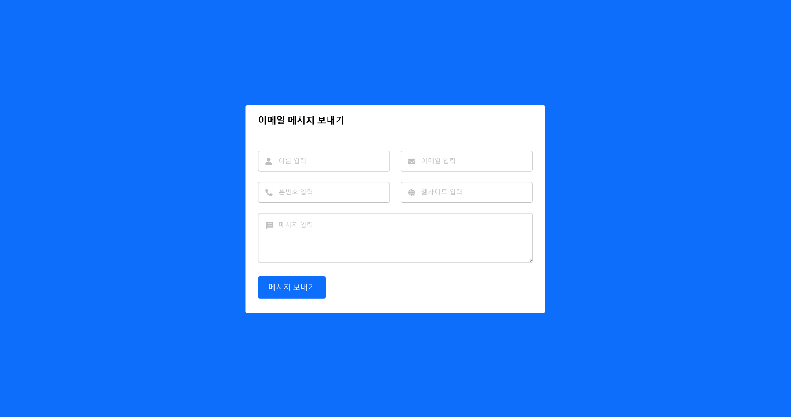

## Create a Working Contact Form in HTML CSS JavaScript & PHP

1. <https://www.youtube.com/watch?v=el4ODMN4bYk&list=PLpwngcHZlPaf1aw42OGyitm4jh2Dlmi9c>

2. 
   이름, 이메일, 폰 번호, 웹 사이트, 보낼 메시지를 작성해서 <br> 메시지 보내기 버튼을 누르면 입력한 이메일 주소로 메시지가 전송됨.

### 전체 구조

```
workingForm
├─ .gitignore
├─ composer.json
├─ composer.lock
├─ index.html
├─ message.php
├─ README.md
├─ screenshot.gif
├─ script.js
└─ style.css
```

### 개발 환경

1. 윈도우 10 프로
2. XAMPP 8.1.2
3. Visual Studio Code

### 코드 사용법

1. GIT CLONE 또는 ZIP 파일 다운로드
2. xampp/htdocs 폴더 안에 다운 받은 파일 복사
3. XAMPP Control Panel 실행 후 Apache Start
4. vscode에서 workingForm 폴더를 연 후 터미널을 켜서 composer install 명령어 실행(vendor 설치)
5. 실사용시 message.php의 $mail->Host, $mail->Username, $mail->Password 등의 세부 내역 수정 필요
6. 브라우저 실행후에 주소창에 http://localhost/workingForm/index.html 입력
